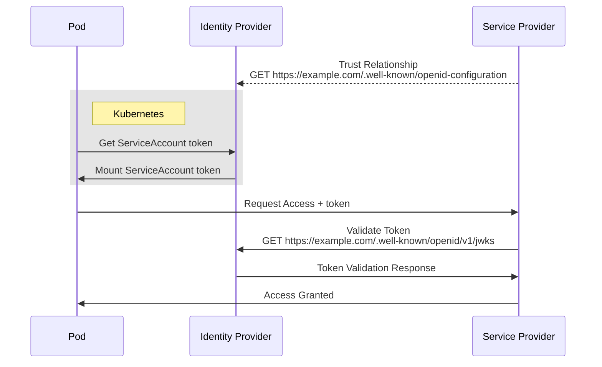

# Kubernetes External Secret Azure Vault

Fetching secrets from Azure Key Vault with External Secret
operator into a Kubernetes cluster.

This approach works with both managed Kubernetes clusters,
as well as the self-managed ones.

The implementation here is using the Kubernetes cluster
from K3d.

## Prerequisites

- [K3d v5][K3d]
- [Opentofu v1.8][opentofu]

## Diagram

<!-- In case mermaidjs live goes down, use the ./assets/diagram.svg :) -->
[](https://mermaid.live/edit#pako:eNqVUk1rAjEQ_Sshp5aqW69LEQotUoogVXraS0zG3dTdZDuZaEX87x33Q4rioWEh2cmbmfde5iC1NyBTGeA7gtPwYlWOqsqc4FUrJKttrRyJuTfXwTczFyrwBo4s7cUc_dYawGvkAnBrNfxBtJjL-HA4mXDVVCwxBhIfUCqy3oXC1k8rTCbT16UoiOqQJgn8qKouYaR9lYx2UJbDjfM7l_ganDVD7d3a5hGbAn0_BE0C85W6exyI7huN79tL5wkE2rwg4dcnxal4jytABwShhXCwZziFs6xnrX1kleQ30DViCAObGrPm7jYUnOnpteUvTUnZB34e9oOzIQTx0KffMLFj-KlKaxRrWp7Q__Qv2Y6Tr90m_JVzTayp3Ddin5lpqPm94CazxpJOxxR5NoDVy4GsACtlDc_i4ZSbSSqggkymfDQKN5nM3JFxKpJf7J2WKWGEgUQf80Kma1UG_ov1SXA3xecoGEseZ-2oNxN__AVRpAQJ)

Click to expand

## Roadmap

- [x] Create the GitHub repository & the deploy key with write permissions
- [x] (Optional) Create the user GPG Key and add it to GitHub user GPG keys
- [x] Spin up the Kubernetes cluster with the issuer URL of the GitHub pages
- [x] Create a K8s cronjob that fetches the OIDC config and commits them to repo
- [x] Create the Azure Key Vault & the managed identity plus the credentials
- [x] Deploy Azure Workload Identity
- [x] Deploy External Secret Operator with the pod annotation of tenant-id and client-id
- [x] Create & fetch a sample secret from Vault into Kubernetes

[K3d]: https://github.com/k3d-io/k3d/releases/v5.7.3/
[opentofu]: https://github.com/opentofu/opentofu/releases/v1.8.1/

## Stacks

The following are the Terragrunt dependency stacks:

Group 1
- tofu/az-key-vault
- tofu/gh-repo
- tofu/user-gpg-key

Group 2
- tofu/k8s-cluster
- tofu/k8s-oidc-config

Group 3
- tofu/az-workload-identity

Group 4
- tofu/external-secrets

Group 5
- tofu/demo-secret-reader
- tofu/vault-secret-store
